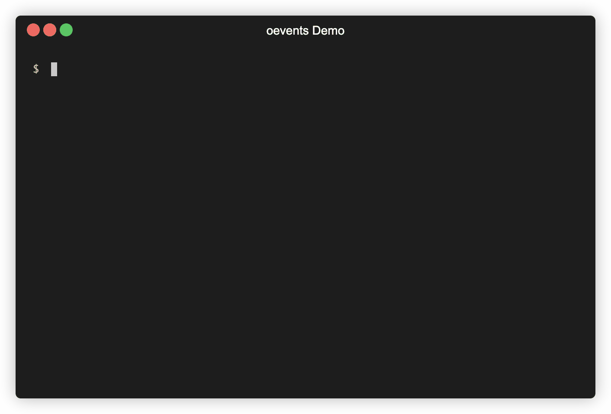

# oevents: A CLI for Optimizely Enriched Event data

Optimizely [Enriched Events Export](https://docs.developers.optimizely.com/optimizely-data/docs/enriched-events-export) gives you secure access to your Optimizely event data so you can analyze your experiment results with greater flexibility. The export includes a useful combination of events attributes:

- Raw metadata (event names, user IDs, etc) that you pass to Optimizely, without additional processing
- Enriched metadata that Optimizely adds such as experiment IDs, variation IDs, and session IDs

For more information, see the Enriched Events [data specification](https://docs.developers.optimizely.com/optimizely-data/docs/enriched-events-data-specification).

This repo contains `oevents`, a simple CLI tool for loading enriched event data.



## Prerequisites: bash (v4+), date, jq, curl, and aws

`oevents` is written in [bash](https://www.gnu.org/software/bash/) and should run on OS X and most GNU/Linux distributions.  You'll need to install the following prerequisites:

- [jq](https://stedolan.github.io/jq/)
- [curl](https://curl.haxx.se/)  (Note: All versions of OS X starting with Jaguar come with curl installed)
- the [Amazon AWS CLI](https://aws.amazon.com/cli/) (v2+) 

## Downloading `oevents`

You can download a zipped directory containing the `oevents` CLI [from this repo](https://github.com/optimizely/oevents/archive/master.zip) or you can download just the shell script [here](https://library.optimizely.com/data/oevents/latest/oevents)

## Installation 

`oevents` is a bash script. To run it, you'll need to make sure it's executable.  Assuming `oevents` is in your working directory, you can do this with the following command:

```sh
$ chmod +x oevents
```

To run `oevents`, you can specify the script's path explicitly like this (again, assuming `oevents` is in your working directory):

```sh
$ ./oevents help
```

Or you can add it to a directory in your `PATH` environment variable.  

```sh
$ sudo cp oevents /usr/local/bin/
$ oevents help
```

## Get Help

For usage instructions, use the `help` command:

```sh
$ oevents help
```

## Authenticating

Optimizely Enriched Event data is served via [Amazon S3](https://aws.amazon.com/s3/). `oevents` uses the [Amazon AWS CLI](https://aws.amazon.com/cli/) to interact with S3, which requires authentication.  You can authenticate to AWS in three ways:

1. (Recommended) Pass your [Optimizely Personal Access Token](https://docs.developers.optimizely.com/web/docs/personal-token) to `oevents` via the `OPTIMIZELY_API_TOKEN` environment variable:

    ```sh
    $ export OPTIMIZELY_API_TOKEN=<token>
    $ oevents ls
    ```
2. Pass your [Optimizely Personal Access Token](https://docs.developers.optimizely.com/web/docs/personal-token) and [Optimizely Account ID](https://help.optimizely.com/Account_Settings/Account_name%2C_ID%2C_and_multi-account_login_in_Optimizely_X) via the `--token` and `--account-id` command line arguments:

    ```sh
    $ oevents ls --token <token> --account-id 12345
    ```
3. Provide your AWS credentials directly. See the [AWS user guide](https://docs.aws.amazon.com/cli/latest/userguide/cli-configure-files.html) for instructions.

**Note:** If you chose methods 1 or 2, `oevents` will acquire temporary AWS credentials using the [Optimizely Authentication API](https://docs.developers.optimizely.com/optimizely-data/docs/authentication-api). You can use the `oevents auth` command to display those credentials or write them to a file.  This is handy if you prefer to access Enriched Event by some other means (e.g. using the AWS CLI directly, or [boto3](https://aws.amazon.com/sdk-for-python/)):

```sh
  $ oevents auth --token <optimizely personal access token>

  export AWS_ACCESS_KEY_ID=<key id>
  export AWS_SECRET_ACCESS_KEY=<secret access key>
  export AWS_SESSION_TOKEN=<session token>
  export AWS_SESSION_EXPIRATION=1594953226000
  export S3_BASE_PATH=s3://optimizely-events-data/v1/account_id=12345/
```

## Exploring your Enriched Event data

[decisions]: https://docs.developers.optimizely.com/web/docs/enriched-events-export#section-decisions
[conversions]: https://docs.developers.optimizely.com/web/docs/enriched-events-export#section-conversions

Enriched Events are partitioned into two top-level datasets, [decisions] (`type=decisions`) and [conversions] (`type=events`).  Each of these datasets is partitioned by date and experiment (for decisions) or event type (for conversions).  

You can use `oevents ls` to list all of the experiments that produced decision data on a given date:

```sh
$ oevents ls --type decisions --date 2020-05-10

                           PRE experiment=10676850402/
                           PRE experiment=14386840295/
                           PRE experiment=14821050982/
                           PRE experiment=15117030650/
                           PRE experiment=17517981213/
                           PRE experiment=17535310125/
                           PRE experiment=8997901009/
```

You can also use `oevents` to list all of the event types collected on a given day:

```sh
$ oevents ls --type events --date 2020-05-10

                           PRE event=search_query/
                           PRE event=search_results_click/
                           PRE event=add_to_cart/
                           PRE event=purchase/
```

## Downloading your Enriched Event data

You can use `oevents load` to download your Enriched Event data in [Apache Parquet](https://parquet.apache.org/) format.  Command line arguments can be used to specify a progressively narrower subset of your data.

The following command will download *all* enriched event data associated with your Optimizely account.  Data will be downloaded into the current working directory. You can configure the destination using the `--output` command line argument or the `OPTIMIZELY_DATA_DIR` environment variable.

```sh
$ oevents load
```

Use the `--type` argument to specify [decisions] or [events][conversions]  The following will download all [decision][decisions] data associated with your Optimizely account:

```sh
$ oevents load \
    --type decisions
```

The following will download all [decision][decisions] data collected between July 1st and 5th, 2020 (inclusive):

```sh
$ oevents load \
    --type decisions \
    --start 2020-07-01 \
    --end 2020-07-05
```

The following will download all [decision][decisions] data for experiment `12345` collected between July 1st and 5th, 2020:

```sh
$ oevents load \
    --type decisions \
    --start 2020-07-01 \
    --end 2020-07-05 \
    --experiment 12345
```

The following will download all [conversion][conversions] data for event `add_to_cart` collected between July 1st and 5th, 2020:

```sh
$ oevents load \
    --type events \
    --start 2020-07-01 \
    --end 2020-07-05 \
    --event add_to_cart
```

## Testing `oevents`

You can run the `oevents` test suite by installing [BATS](https://github.com/bats-core/bats-core) and running `test.bats` in this directory.  Note: the `oevents` test suite requires bash v4.4+.


## Acknowledgements

This software depends on code from the following wonderful open source projects:

#### aws-cli
Copyright (c) 2012-2020 Amazon.com, Inc. or its affiliates.
[License (Apache 2.0)](https://github.com/aws/aws-cli/blob/develop/LICENSE.txt)

#### jq
Copyright (c) 2012 Stephen Dolan.
[License (MIT)](https://github.com/stedolan/jq/blob/master/COPYING)

#### curl
Copyright (c) 1996 - 2020, Daniel Stenberg, daniel@haxx.se, and many
contributors.
[License (MIT)](https://github.com/curl/curl/blob/master/COPYING)